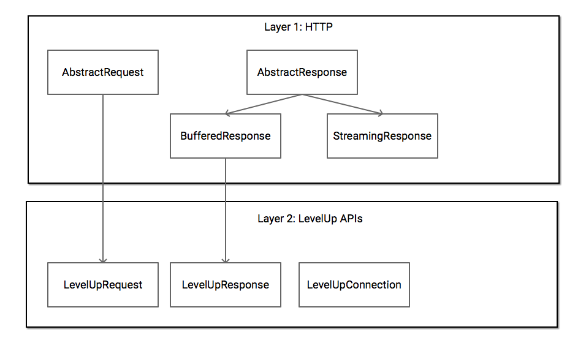

# Core SDK

The LevelUpCoreLib provides client-server communication with the LevelUp web service.

Most usage of the SDK consists of generating a request with an appropriate `RequestFactory`, using
`LevelUpConnection` to get `LevelUpResponse`s for those requests, and then using an appropriate
`AbstractJsonModelFactory` subclass to turn the result into an instance of a particular model.

## Networking Library

The networking component wraps the full power of the standard Android HTTP libraries with a set of
classes that offer a simplified interface. The LevelUp-specific classes are built on top of a
generalized set of HTTP components:

The first generic HTTP layer provides a base AbstractRequest class and both a streaming and buffered
Response class that encapsulate generic HTTP communication.

The second layer is a set of LevelUp web service API calls, helpers, and tools, which makes it
easier to work specifically with the LevelUp API web service for authentication, RESTful request
building, and JSON response parsing.

## RequestFactories

Each of the LevelUp web service endpoints offers a different API.  To simplify interaction with
these endpoints, LevelUpCoreLib provides factory classes to build AbstractRequest objects to send to
the LevelUp web service.

## JsonFactories

An AbstractRequest created by a RequestFactory is sent via the Network component, resulting in an
`LevelUpResponse` object.  Requests are associated with a corresponding `AbstractJsonFactory`
instance object that parses the response into a model object.

## Models

The responses from the LevelUp web service can be parsed via an `AbstractJsonFactory` subclass into
a Java model object. By convention, these Model objects are immutable and Parcelable.

## Use of Lombok

To make it easier to maintain our Java model objects, we use
[Project Lombok][project-lombok]. This tool automatically generates constructors,
getters, builders, etc. based on annotations.

This processing is handled automatically by the build scripts; you may want to use the
[IntelliJ Lombok plugin][intellij-lombok-plugin] if you're using Android Studio or
IntelliJ IDEA to make working with Lombok code easier.

# Using the SDK

## Overview

A typical flow using the LevelUp Core Library is:

1. Obtain an access token (usually only needed once, then can be cached unless expired). See the
  documentation on the [Deeplink Auth library][deeplink-auth-docs] for details.
  - Enterprise-licensed apps can also use [Enterprise login][enterprise-flows] to get an access
    token.
2. Construct a `RequestFactory`, using an `AccessTokenRetriever` [as described below]
  [access-token-retriever] for authenticated requests.
3. Call one of the factory methods on the `RequestFactory` to get an  `AbstractRequest` object.
4. Call `LevelUpConnection.send()` to transmit the `AbstractRequest` object and receive a
  `LevelUpResponse` object.
5. If the returned response's `LevelUpResponse.getStatus()` is not `LevelUpStatus.OK`, [handle the
   error][error-parsing]
6. Construct the appropriate `AbstractJsonFactory` object to parse the `LevelUpResponse` object into
  a Model object.

<a name="access-token-retriever" />
## Authenticating requests to the LevelUp web service

**NOTE:** `AccessToken`s should be considered as sensitive user data and should be protected
accordingly.

1. Once you have obtained an `AccessToken` for a user, you should persist it however you typically
  persist secure data in your app.
2. You will need to write a `Parcelable` class that implements `AccessTokenRetriever` which
  will retrieve the cached `AccessToken`.
3. For every `RequestFactory` that requires an authorized user, pass an instance of your class that
  implements `AccessTokenRetriever` to the constructor.

A few specific example flows:

## Obtaining a Payment Token

1. Call `PaymentTokenRequestFactory.buildGetPaymentTokenRequest()` to obtain an `AbstractRequest` to
  get LevelUp payment code information for the current user.
2. Send the `AbstractRequest` with `LevelUpConnection.send()`.
3. If the request returns `LevelUpStatus.OK`, then parse the resulting `LevelUpResponse` object with
  `PaymentTokenJsonFactory`, which results in a `PaymentToken` model object.
4. The QR code used for payment can be generated using `PaymentToken.getData()`. To easily generate
  the proper QR code, see the [`LevelUpCodeView`](levelup-code-view) class.
5. If the request returns `LevelUpStatus.ERROR_NOT_FOUND`, then the user is not payment eligible,
  usually due to a problem with a credit card on file. The returned [error message][error-parsing]
  should have more information on how the user can resolve the issue; they'll generally need to be
  redirected to the LevelUp app to resolve the issue.
  - If your app registered the user and they have no cards on file yet (or your app is
    [Enterprise-licensed][enterprise-sdk-docs]) you may be able to prompt the user to add a credit
    card directly to resolve the issue, depending on the `Error.code`.

## Adding a Credit Card

If your app registered the user and they have no cards on file yet (or your app is
  [Enterprise-licensed][enterprise-sdk-docs]) you can add a credit card on behalf of the user.
  The request builder will automatically encrypt the credit card number clientside before
  transmitting it to LevelUp so that only LevelUp's vault provider can read the value.

1. Call `CreditCardRequestFactory.buildCreateCardRequest()` to obtain an `AbstractRequest` to add a
  new credit card to the user's account.
2. Send the `AbstractRequest`.
3. Parse the resulting `LevelUpResponse` object with `CreditCardJsonFactory`, which results in a
  `CreditCard` model object.

<a name="error-parsing" />
## Error Handling

`LevelUpResponse.getStatus()` gives indications of what (if anything) went wrong with a request.
If there was a web service response error, you can retrieve a list of `Error` objects with 
`LevelUpResponse.getServerErrors()`. This object contains fields corresponding to the LevelUp 
web service JSON array response. The code and object fields matches up with the `ErrorCode` and 
`ErrorObject` enumerations respectfully. A specific `Error` object can also be retrieved using 
`LevelUpResponse.getServerError(ErrorObject, ErrorCode)`.

Typically the LevelUp web service will respond with a JSON array describing the errors that 
occurred. In the case the web service responses in a different format, the raw message is 
available in `LevelUpResponse.getData()`. Any network or parsing exception can be found in 
`LevelUpResponse.getError()`.

<a name="enterprise-flows" />
# Additional Enterprise-Only Flows

## User Creation (Enterprise Flow)

This flow allows [Enterprise-licensed apps][enterprise-sdk-docs] to create a user
with an email address and password. Most apps should use the [deeplink flow][deeplink-auth-docs]
from `levelUpDeeplinkAuthLib` instead of this to get an access token.

1. Call `UserRequestFactory.buildRegisterRequest()` to obtain an `AbstractRequest` to register a
new user.
2. Send the request.
3. Parse the resulting `LevelUpResponse` object with the
`UserJsonFactory`.
4. Use the same credentials used to register the `User` to then Log them in
using the steps below.

## Logging In (Enterprise Flow)

This flow allows [Enterprise-licensed apps][enterprise-sdk-docs] to get an access
token directly with a user's credentials. Most apps should use the [deeplink flow]
[deeplink-auth-docs] from `levelUpDeeplinkAuthLib` instead of this to get an access token.

1. Call `AccessTokenRequestFactory.buildLoginRequest()` to obtain an `AbstractRequest` to log in
an existing user.
2. Send the `AbstractRequest`.
3. Parse the resulting `LevelUpResponse` object with `AccessTokenJsonFactory`, which results in an
`AccessToken` model object.
4. Persist the `AccessToken` model object to authenticate other requests to the LevelUp web service.

[access-token-retriever]: #access-token-retriever
[deeplink-auth-docs]: ../deeplinkAuthLib/README.md
[enterprise-flows]: #enterprise-flows
[enterprise-sdk-docs]: http://developer.thelevelup.com/enterprise-sdk/
[error-parsing]: #error-parsing
[intellij-lombok-plugin]: http://plugins.jetbrains.com/plugin/6317
[levelup-code-view]: src/main/java/com/scvngr/levelup/core/ui/view/LevelUpCodeView.java
[project-lombok]: http://projectlombok.org/
